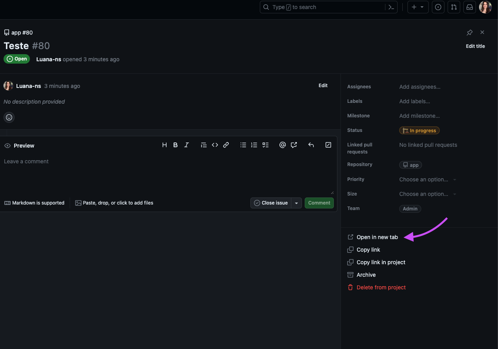
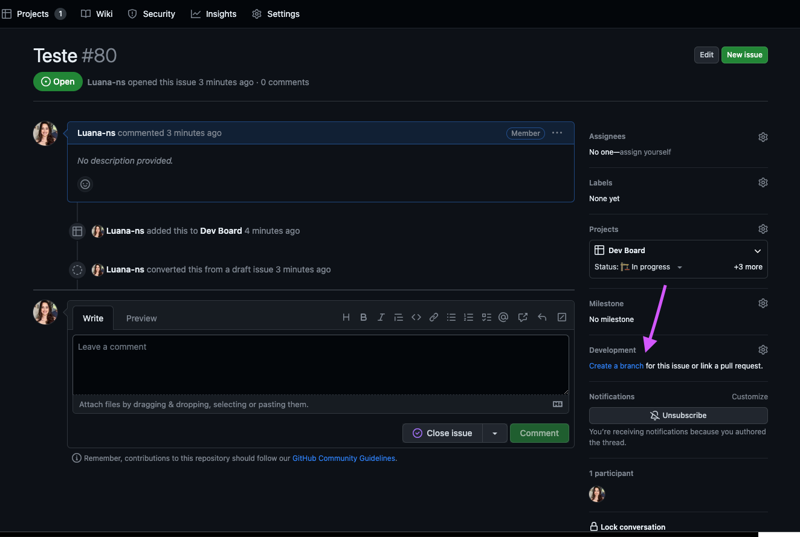
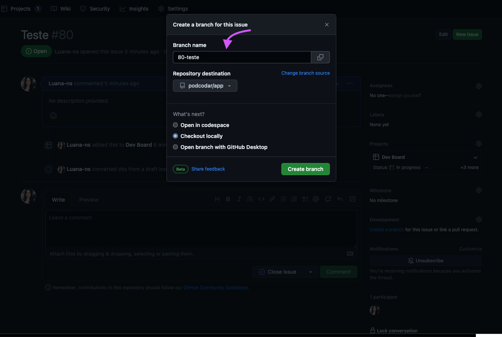
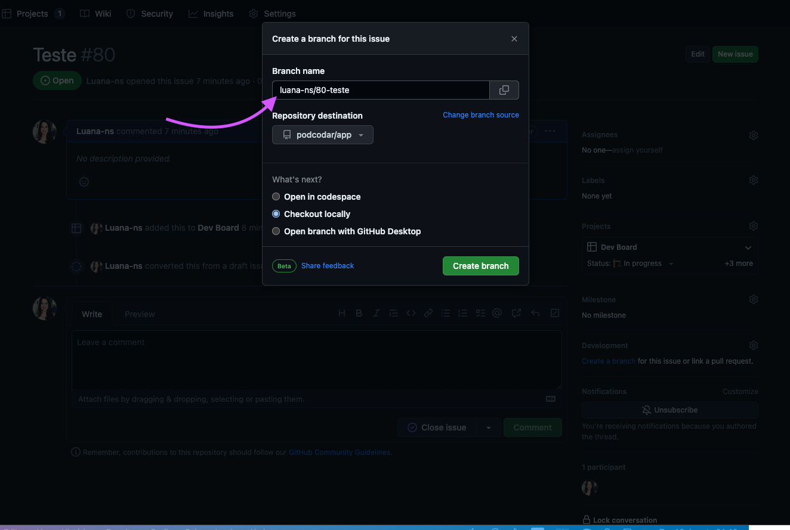

## Contribution Guidelines

Do you want to contribute to the project and don't know how to do it? :confused::question:\
Follow the steps below and get to work!
:satisfied:

### 1º - Clone the project.

### 2º - Create a branch for your feature.

The branch needs to be off of `master`. Follow the steps to create your branch name:

1. First open the issue on GitHub and click "Open in new tab". 

2. Then click "Create a branch" to create a new branch already linked to your issue. 

3. In the new window, the branch name suggestion will appear according to the issue. 

4. Now add your GitHub username at the beginning of the branch name, separating them with a bar `/`. 

In your terminal, access your branch using the command:

`git checkout your-branch-name`.

### 3º - Make your modifications.

### 4º - Commit your changes.

Always do [semantics commits][1]. Use the following commit pattern to keep an organized history and use only the first 3 letters of each type:

| **types** |                     **when to use**                      | **how to use** |
| :-------: | :------------------------------------------------------: | :------------: |
|   chore   |    Maintenance tasks such as updating dependencies\.     |      cho       |
|   docs    |                  Documentation update\.                  |      doc       |
|   feat    |       Addition of a new functionality or feature\.       |      fea       |
|    fix    |                   Correção de um bug\.                   |      fix       |
| refactor  |               Refactoring existing code\.                |      ref       |
|   style   | Style changes that do not affect the meaning of the code |      sty       |
|   test    |           Addition or modification of tests\.            |      tes       |

Example:

`git commit -m fea: my new feature`.

### 5º - Push your branch:

`git push origin your-branch-name`.

### 6º - Create a pull request on Github.

Describe what changes were made and how they affect the project. Provide detailed information about your changes. Piece of cake :cake::star:

[1]: https://programadriano.medium.com/dica-r%C3%A1pida-commits-sem%C3%A2nticos-e0ca2139badd#:~:text=Chore%3A%20Utilizamos%20o%20chore%20quando,como%3A%20adicionar%20algo%20dentro%20do%20.
