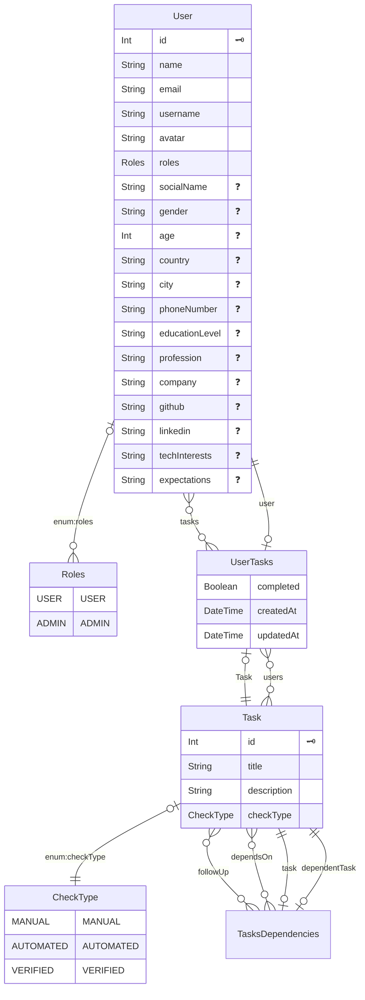

```mermaid
erDiagram

        Roles {
            USER USER
ADMIN ADMIN
        }
    


        CheckType {
            MANUAL MANUAL
AUTOMATED AUTOMATED
VERIFIED VERIFIED
        }
    
  "User" {
    Int id "🗝️"
    String name 
    String email 
    String username 
    String avatar 
    Roles roles 
    String socialName "❓"
    String gender "❓"
    Int age "❓"
    String country "❓"
    String city "❓"
    String phoneNumber "❓"
    String educationLevel "❓"
    String profession "❓"
    String company "❓"
    String github "❓"
    String linkedin "❓"
    String techInterests "❓"
    String expectations "❓"
    }
  

  "Task" {
    Int id "🗝️"
    String title 
    String description 
    CheckType checkType 
    }
  

  "UserTasks" {
    Boolean completed 
    DateTime createdAt 
    DateTime updatedAt 
    }
  

  "TasksDependencies" {

    }
  
    "User" o|--}o "Roles" : "enum:roles"
    "User" o{--}o "UserTasks" : "tasks"
    "Task" o{--}o "UserTasks" : "users"
    "Task" o|--|| "CheckType" : "enum:checkType"
    "Task" o{--}o "TasksDependencies" : "followUp"
    "Task" o{--}o "TasksDependencies" : "dependsOn"
    "UserTasks" o|--|| "User" : "user"
    "UserTasks" o|--|| "Task" : "Task"
    "TasksDependencies" o|--|| "Task" : "task"
    "TasksDependencies" o|--|| "Task" : "dependentTask"
```
